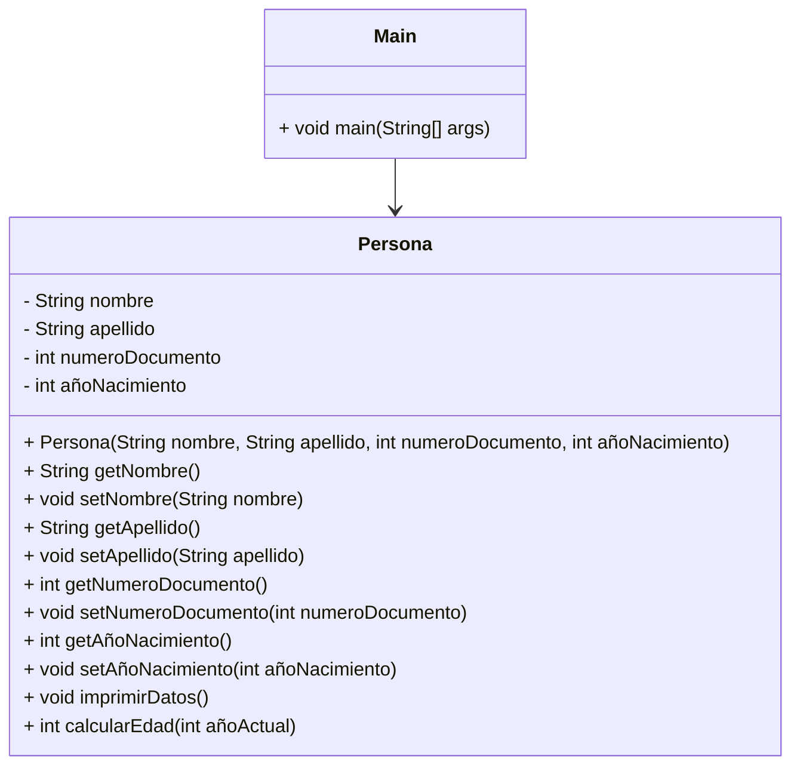

# Diagrama de Clases

```mermaid
classDiagram
    class Persona {
        - String nombre
        - String apellido
        - int numeroDocumento
        - int añoNacimiento
        + Persona(String nombre, String apellido, int numeroDocumento, int añoNacimiento)
        + String getNombre()
        + void setNombre(String nombre)
        + String getApellido()
        + void setApellido(String apellido)
        + int getNumeroDocumento()
        + void setNumeroDocumento(int numeroDocumento)
        + int getAñoNacimiento()
        + void setAñoNacimiento(int añoNacimiento)
        + void imprimirDatos()
        + int calcularEdad(int añoActual)
    }

    class Main {
        + void main(String[] args)
    }

    Main --> Persona
```